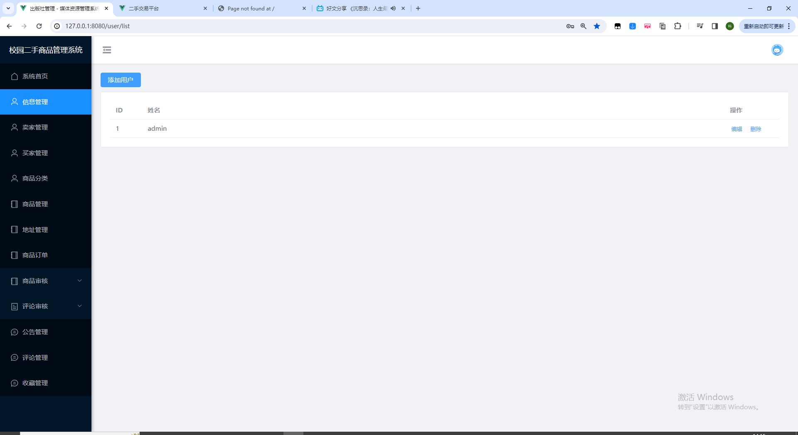

**在线购买系统**：https://ake999.com/33.html


```python
项目背景介绍：
校园二手交易市场是大学生生活中的重要组成部分，它为学生提供了一个便捷的方式来买卖物品。然而，传统的校园二手交易方式存在着信息不对称、交易风险高等问题。为了解决这些问题，基于Django和Vue的校园二手交易市场系统应运而生。该系统结合了后端开发框架Django和前端开发框架Vue，旨在提供一个安全、高效、用户友好的交易平台，以满足学生们的二手物品交易需求。该研究旨在探索如何利用现代技术构建一个功能强大的校园二手交易市场系统，为学生们创造更好的交易体验。
```


系统核心功能


   

   
**在线购买系统**：https://ake999.com/33.html

需要代码，联系微信 python_kk或者qq：976870170（备注github，不备注不通过）

需要代码，联系微信 python_kk或者qq：976870170（备注github，不备注不通过）

需要代码，联系微信 python_kk或者qq：976870170（备注github，不备注不通过）


一、主要技术：python、django、vue、mysql、echarts、bootstrap、jquery、css、cookie、session等基本技术实现

**系统亮点1：python框架和vue做毕设，做的人少！django开发便捷，容易毕业！！！！！！**

**系统亮点2：多角色不同页面，管理员拥有管理员页面，卖家有卖家页面，买家有买家页面**

**系统亮点3：界面ui非常美观**

系统亮点4：加入审核和加入打分


 二、主要功能:

管理员功能：

```python
系统首页
信息管理
卖家管理
买家管理
商品分类
商品管理
地址管理
商品订单
商品审核
评论审核
```


卖家功能

```python
前台首页
分类查看
搜索查看
公告查看
发布商品
修改资料
商品管理
	我发布的
	待发货
	待收货
	已收货
```


买家功能

```python
前台首页
分类查看
搜索查看
公告查看
商品评论
	审核通过评论
	审核拒绝评论
	我的评论
商品收藏
	收藏
	取消收藏
	我的收藏
购物车管理
地址管理
修改资料
商品管理
	待发货
	待收货
	已收货
	已退款
```


三、用例图，数据库er图


四、数据库

```python
class Guanli(models.Model):
    username = models.CharField(max_length=255)
    password = models.TextField()

# 卖家
class Chushou(models.Model):
    # 姓名
    name = models.CharField(max_length=255,null=True,blank=True,unique=True)
    # 密码
    password = models.CharField(max_length=255,null=True,blank=True)
    img_url = models.CharField(max_length=255, null=True, blank=True)
    # 学院
    college_cs = models.CharField(max_length=255, default='计算机学院', null=True, blank=True)

# 买家
class Goumai(models.Model):
    # 姓名
    name = models.CharField(max_length=255,null=True,blank=True,unique=True)
    # 密码
    password = models.CharField(max_length=255,null=True,blank=True)
    img_url = models.CharField(max_length=255, null=True, blank=True)
    # 学院
    college_gm = models.CharField(max_length=255,default='计算机学院',null=True,blank=True)

# 二手商品分类表
class ErshouFenlei(models.Model):
    mingcheng = models.CharField(max_length=255)

# 二手商品表
class Ershou(models.Model):
    title = models.CharField(max_length=255,null=True,blank=True)
    img_url = models.CharField(max_length=255,null=True,blank=True)
    miaoshu = models.CharField(max_length=255,null=True,blank=True)
    price = models.FloatField()
    is_shenhe = models.CharField(max_length=255, null=True, blank=True, default='待审核')
    maijia = models.ForeignKey(Chushou, on_delete=models.CASCADE)
    fenlei = models.ForeignKey(ErshouFenlei,on_delete=models.CASCADE)
```


后台功能：

管理员：

系统首页，这里主要是做了几个div布局和一些文字信息


信息管理，管理员可以修改密码




卖家管理，管理员可以看到所有卖家的信息，头像，姓名，密码，学院


买家管理，管理员可以看到所有买家的信息，头像，姓名，密码，学院


商品分类，管理员可以看到商品分类


商品管理，管理员可以增删改查商品


地址管理，管理员可以增删改查地址


订单管理，管理员可以在后台看到所有订单


商品审核，商家发布商品后需要通过审核以后才可以显示


评论审核，买家评论商品后需要通过审核以后才可以显示


公告管理：管理员可以增删改查公告


评论管理：卖家可以看到所有评论


收藏管理：管理员可以增删改查所有收藏


**前台功能：**

**卖家：**

登录


注册


前台首页


前台详情


前台公告


前台发布


前台我的


前台修改个人信息


**买家：**

购物车


信息


我的


收藏


评论


地址


后端部分代码：

```python
# 全部评论接口
class qbPlview(APIView):
    def get(self, request):
        # 获取数据集（学生模型对象）
        students_data = Ershoupl.objects.all()
        pageNum = request.GET.get('pageNum', '')
        pageSize = request.GET.get('pageSize', '')

        # 后台过滤
        search_nick_term = request.GET.get('content', '')
        if search_nick_term:
            search_nick_term = search_nick_term.strip()
            students_data = students_data.filter(content__icontains=search_nick_term)
        # 自定义分页 过滤后再次分页
        paginator = Paginator(students_data, pageSize)
        page_obj = paginator.get_page(pageNum)
        # 拿到分页对象
        page_obj_dq = page_obj.object_list
        # 拿到总数
        page_obj_zs = paginator.count
        # 实例化序列化器，得到序列化器对象
        # 分页对象进行序列化
        ser = PlModelSerializers(instance=page_obj_dq, many=True)
        # 调用序列化器对象的data属性方法获取转换后的数据
        data = ser.data

        # 响应数据
        return Response(data={'code': 200, 'zs': page_obj_zs, 'data': data})
class Plview(APIView):
    # 单个禁用 token 验证
    authentication_classes = []

    def get(self, request):
        # 获取数据集（学生模型对象）
        students_data = Ershoupl.objects.filter(is_shenhe='待审核')
        pageNum = request.GET.get('pageNum', '')
        pageSize = request.GET.get('pageSize', '')

        # 前台过滤
        spid = request.GET.get('spid', '')
        if spid:
            students_data = Ershoupl.objects.filter(shangpin_id=spid)

        # 后台过滤
        search_nick_term = request.GET.get('title', '')
        if search_nick_term:
            search_nick_term = search_nick_term.strip()
            students_data = students_data.filter(title__icontains=search_nick_term)
        # 自定义分页 过滤后再次分页
        paginator = Paginator(students_data, pageSize)
        page_obj = paginator.get_page(pageNum)
        # 拿到分页对象
        page_obj_dq = page_obj.object_list
        # 拿到总数
        page_obj_zs = paginator.count
        # 实例化序列化器，得到序列化器对象
        # 分页对象进行序列化
        ser = PlModelSerializers(instance=page_obj_dq, many=True)
        # 调用序列化器对象的data属性方法获取转换后的数据
        data = ser.data
```


代码为付费获取，请知悉
